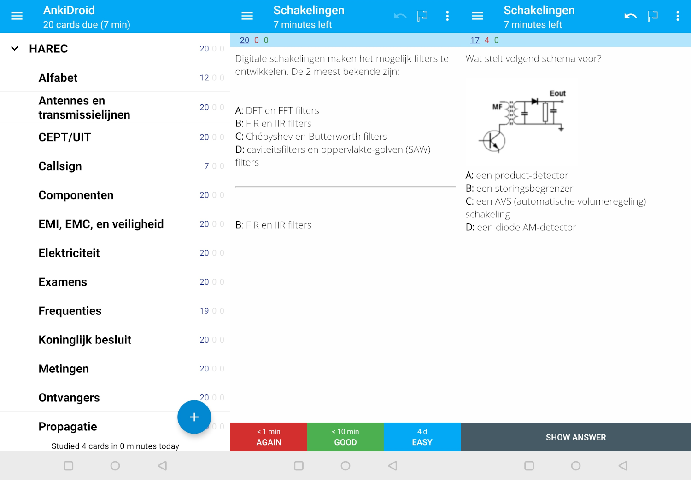

# Belgian radio amateur HAREC exam

This repository contains a generator for Anki cards for the Belgian HAREC exam.



## Usage

```
$ nix-shell
$ ./generate-deck.py
```

Then import `deck.apkg` into Anki.
